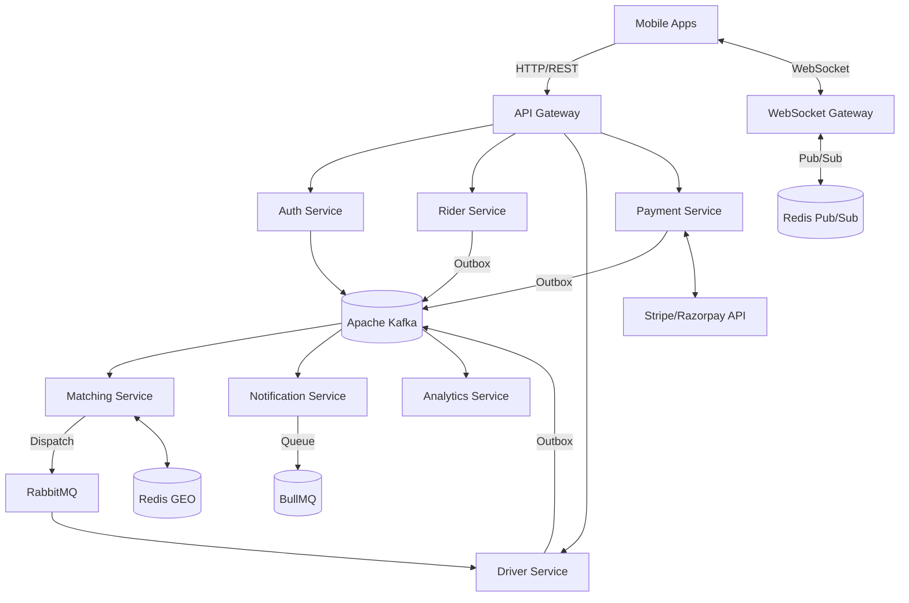
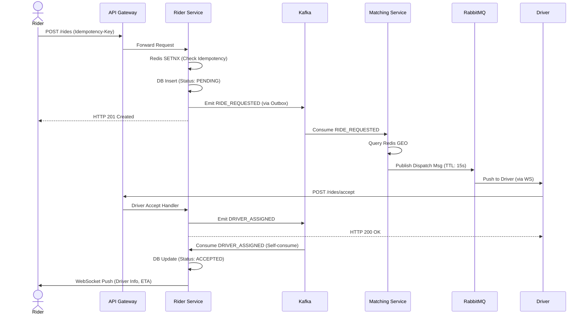
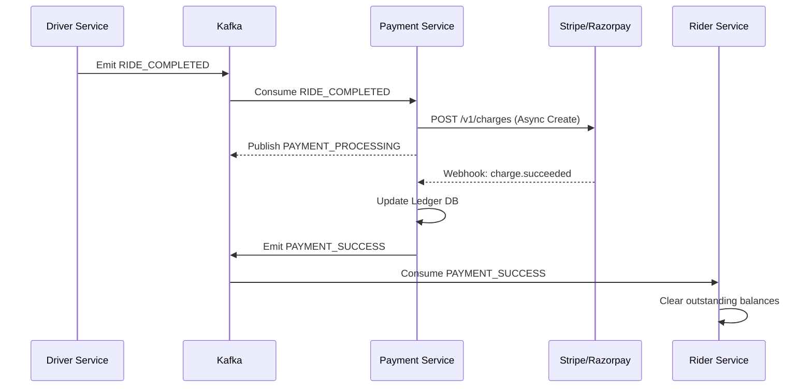

# Production Uber-Clone System Architecture & Request Flow

This document details the end-to-end request lifecycle, architectural decisions, state management, and resilience patterns for the Uber-clone backend platform. 

---

## 1. End-To-End Request Flow

The system orchestrates operations across multiple microservices using an event-driven architecture, ensuring high availability and loose coupling.

### Ride Booking Flow
1. **User clicks "Request Ride"**: The Rider App sends an HTTP POST request to the **API Gateway**.
2. **API Gateway Handling**: Validates the JWT, applies rate limiting, and routes the request to the **Rider Service**.
3. **Rider Service (Idempotency)**: Intercepts the request and checks an Idempotency-Key against Redis using `SETNX`. If a duplicate is found, the previous response is returned. The service then persists the initial `PENDING` ride state to the database.
4. **Kafka Event (`RIDE_REQUESTED`)**: Using the Outbox Pattern, the Rider Service securely emits a `RIDE_REQUESTED` event to Kafka.
5. **Matching Service**: Consumes the event, queries Redis GEO to identify nearby available drivers, and applies ranking algorithms (ETA, rating). 
6. **RabbitMQ Dispatch**: The Matching Service pushes a localized, TTL-bounded dispatch message to RabbitMQ routed exclusively to the selected driver.
7. **Driver Accept/Reject Flow**: The Driver App receives the prompt via WebSocket. If the driver accepts, an HTTP request hits the Driver Service.
8. **Kafka Event (`DRIVER_ASSIGNED`)**: The Driver Service locks the driver's availability and emits the `DRIVER_ASSIGNED` event via Kafka. 
9. **Rider Updates**: The Rider Service consumes this event, updates the database state to `ACCEPTED`, and pushes the confirmation (driver details, ETA) to the rider via the WebSocket Gateway.

### Ride Execution Flow
1. **Ride Start**: The driver initiates the ride. The HTTP request hits the Driver Service, transitioning state and emitting a `RIDE_STARTED` event.
2. **Real-Time Location**: The Driver App continuously streams GPS coordinates (every 3s) to the WebSocket Gateway.
3. **Redis Pub/Sub Usage**: The WebSocket Gateway publishes these coordinates to a Redis Pub/Sub channel (e.g., `ride:{rideId}:location`). 
4. **WebSocket Updates to Rider**: The Rider's connected WebSocket node is subscribed to this channel and immediately pushes the coordinates to the Rider App, achieving sub-second latency.

### Ride Completion + Payment Flow
1. **Ride Completion**: The driver ends the ride. The Rider Service (or Driver Service) calculates final fare details, updates DB state, and emits `RIDE_COMPLETED`.
2. **Payment Service Orchestration**: The Payment Service consumes `RIDE_COMPLETED` and initiates the charge against the registered card via the Payment Gateway (Stripe/Razorpay).
3. **Webhook Handling**: The Payment Gateway asynchronously callbacks the system's Webhook endpoint. 
4. **Kafka (`PAYMENT_SUCCESS` / `PAYMENT_FAILED`)**: The Payment Service receives the webhook, finalizes the ledger, and emits the decisive event to Kafka.
5. **Rider Service Final State**: The Rider Service consumes the payment event, transitions to `COMPLETED` (or flags for outstanding balances), and triggers the receipt notification.

### Notification Flow
1. **Event Consumption**: The Notification Service listens to various Kafka events (`DRIVER_ASSIGNED`, `PAYMENT_SUCCESS`).
2. **BullMQ Queueing**: For external providers with high latency and rate limits (SMS via Twilio, Email via SendGrid), the Notification Service enqueues jobs into BullMQ.
3. **Asynchronous Processing**: BullMQ workers process the jobs asynchronously, handling 3rd-party outages with exponential backoff and retries.
4. **Instant Push**: For immediate in-app alerts, the service directly calls the WebSocket Gateway.

### Analytics Flow
1. **Event Streaming**: Every lifecycle event across all services is consumed by the Analytics Service.
2. **Aggregation + Storage**: Data is processed (often via Flink/Spark for real-time aggregations) and sunk into a column-oriented Data Warehouse (e.g., ClickHouse or Snowflake).
3. **Real-Time Metrics**: Continuously updates materialized views for dynamic surge pricing algorithms, heatmaps, and driver earning dashboards.

### Admin Flow
1. **Admin Actions**: Support staff issue commands (e.g., suspend user, issue refund) via the Admin Service.
2. **System Impact**: The Admin Service emits domain events. For example, a `USER_SUSPENDED` event triggers the Auth Service to revoke tokens and the Rider Service to terminate active requests.

---

## 2. Architecture Diagrams

### High-Level Microservice Architecture

> [!NOTE]
> System components communicate synchronously via the API Gateway to edge services, and asynchronously via Kafka for inter-service state transitions.

### Ride Booking Sequence Diagram

### Payment Flow Sequence Diagram

---

## 3. How Requests Are Managed

We employ a polyglot messaging architecture, selecting the integration style based on the specific guarantees required by the flow.

*   **Synchronous HTTP (API Gateway)**: Used strictly for client-to-edge communication where the client expects immediate validation or domain constraint checking (e.g., *Does this user exist? Do they have a valid payment method?*).
*   **Apache Kafka (Event Choreography)**: The backbone of the system. Used for durable, highly-available asynchronous events determining state transitions. It provides persistent storage and replayability. If a service goes down, it catches up upon recovery.
*   **RabbitMQ (Driver Dispatch)**: Chosen for its robust routing capabilities (Direct/Topic exchanges) and built-in **Message TTL**. When dispatching a driver, the offer must expire in exactly 15 seconds. RabbitMQ handles this ephemeral matching lifecycle better than Kafka's persistent log.
*   **BullMQ (Background Jobs)**: Redis-backed job queue utilized specifically for tasks prone to intermittent failure (3rd-party APIs like email/SMS). It handles progressive, exponential backoff, delaying, and Dead Letter Queues (DLQ) efficiently without blocking event streaming.

---

## 4. Data Flow + State Ownership

To maintain autonomy, each microservice strictly owns its operational data. No microservice can directly access another's database.

*   **Rider Service**: Owns the Rider entity and the Master Ride State Machine (`PENDING`, `ACCEPTED`, `IN_PROGRESS`, `COMPLETED`, `CANCELLED`).
*   **Driver Service**: Owns Driver Profiles, Vehicle Details, and real-time Availability State.
*   **Payment Service**: Owns the immutable financial ledger, invoices, and Stripe reference mappings.
*   **State Transitions**: Handled via **Saga Choreography**. A transaction spanning multiple services involves one service completing its local transaction, emitting an event, and downstream services reacting. Consistency here is **Eventual**.

---

## 5. Failure Handling

Distributed systems fail. Resiliency is built in to handle faults gracefully.

*   **Matching Fails (No Drivers)**: The Matching Service exhausts its radius. It emits a `MATCHING_FAILED` event. The Rider Service consumes this, transitions the ride to `CANCELLED`, and informs the client via WebSocket.
*   **Driver Doesn't Respond**: The RabbitMQ dispatch TTL (e.g., 15s) expires. The message is routed to a RabbitMQ DLX (Dead Letter Exchange). The Matching Service consumes the DLX, excludes the previous driver, and evaluates the next best candidate.
*   **Payment Fails**: The Payment Webhook returns an error. The Payment Service emits `PAYMENT_FAILED`. **Saga Compensation**: The Rider Service flags the user account with a "Debt" status. Future ride requests are blocked at the API Gateway level until the debt is cleared.
*   **Notification Fails**: If SendGrid is down, BullMQ catches the failure. It attempts 5 retries with exponential backoff (e.g., 10s, 30s, 2m). If it fails completely, it's moved to a **DLQ (Dead Letter Queue)** for manual intervention or automated alerts.

---

## 6. Advanced Guarantees

> [!IMPORTANT]  
> Production environments demand strict adherence to data integrity. The following patterns are mandatory across all services writing to the core workflow.

### Outbox Pattern
Services must never write to their DB and publish to Kafka sequentially (Dual-Write problem—if Kafka is down, the DB is updated but the system halts).
**Solution**: Services persist the entity update AND an `EventOutbox` record within the **same atomic database transaction**. A separate background process (or Debezium CDC) polls the Outbox table and reliably publishes to Kafka.

### Idempotency
Clients retry requests when networks drop. To prevent charging a user twice:
**Solution**: Every state-mutating API requires an `Idempotency-Key` header. The Gateway checks `SETNX idempotency:{userId}:{key}` in Redis. If successful, the request goes through. If the key exists, the cached previous response is returned.

### Exactly-Once Processing
Kafka guarantees at-least-once delivery. Network blips can cause duplicate event consumption.
**Solution**: Consumers track processed messages. The worker attempts to write the `eventId` to an `ProcessedEvents` table in the DB within the same transaction it updates business logic. A Unique Constraint Violation signals a duplicate event, which is safely acknowledged and discarded.

### Cache Consistency
Using Redis accelerates read-heavy paths (e.g., fetching driver profiles). 
**Solution**: We utilize a **Write-Around / Event-Driven Cache Invalidation** strategy. A service updates the DB and fires a domain event. A dedicated consumer strictly listens to update events and aggressively deletes the stale Redis keys.

### Kafka Partitioning
State machines require strict ordering. (A ride cannot be `COMPLETED` before it is `RIDE_STARTED`).
**Solution**: All ride-lifecycle events utilize `rideId` as the Partition Key. Kafka guarantees strict chronological order for messages within the same partition, ensuring the consumer processes state transitions in exact order.

---

## 7. Real-Time System (Live Location & WebSockets)

The platform requires high-throughput, low-latency telemetry for ride tracking.

*   **WebSocket Gateway**: A horizontal cluster of Node.js instances holding persistent TCP connections. Connection metadata (Server ID <-> User ID) is mapped in Redis.
*   **Redis Pub/Sub Architecture**: Used for cross-server communication. If Driver is connected to WebSocket-Node-A and Rider is to WebSocket-Node-B:
    1. Driver App emits location to Node-A.
    2. Node-A publishes to Redis Pub/Sub: `PUBLISH channel:ride_123_loc '{"lat":12, "lng":34}'`.
    3. Node-B, observing the Rider's active ride, is subscribed to `channel:ride_123_loc`.
    4. Node-B receives the payload and pushes it down the Rider's socket.
*   **Guarantee Level**: Live location tracking treats data as **ephemeral**. We do not use Kafka for streaming telemetry because occasional dropped GPS packets are acceptable compared to the latency penalty of persistent storage.

---

## 8. Final Summary

This Uber-clone architecture acts as a loosely coupled orchestration of autonomous state machines. 

When a user requests a ride, the **API Gateway** validates the request synchronously. It hands off to the **Rider Service**, which locks idempotency and defers to **Kafka** via the **Outbox Pattern** to broadcast a `RIDE_REQUESTED` event. This decouples the edge API from internal heavy lifting.

The **Matching Service** handles geospatial complexity quickly using **Redis**, offloading ephemeral driver targeting to **RabbitMQ**. Once accepted, the system shifts back to the durable **Kafka** log. Real-time telemetry bypasses persistent storage entirely, using **Redis Pub/Sub** and a **WebSocket Gateway** cluster to stream coordinates with extreme low latency. 

Finally, as the ride concludes, asynchronous Saga workflows coordinate the **Payment Service** and Stripe webhooks to finalize ledgers, while the **Analytics Service** silently ingests all system events downstream, providing the intelligence required to scale the business operations in real-time.
